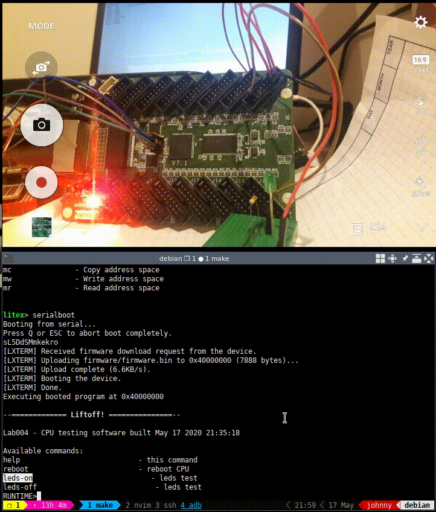

# Litex vexriscv blink en colorlight5a-75e




En éste ejemplo se encenderá el LED de la placa y un LED externo conectado a J1.3
a través de tokens dados desde el prompt

Los tokens son:

* **leds-on**: Encender los LEDs
* **leds-off**: Apagar los LEDs

## Requerimientos

* Herramientas de desarrollo -> [link](https://github.com/unal-digital-electronic/litex-and-softcore-projects/wiki/Herramientas-para-FPGAs-Lattice)
* LiteX con soporte para la board colorlight5a-75e -> [link](https://github.com/unal-digital-electronic/litex-and-softcore-projects/wiki/Instalaci%C3%B3n-de-Litex#litex-para-placa-colorlight-5a-75e)
* Programador para FPGA Lattice -> [link]() // TODO se requiere relacionar la lista de prgramadores
* Adaptador UART (USB-UART, Omega2, Raspberry...)
* Colorlight5a-75e //TODO se requiere relacionar modificaciones en el hardware

## Conexiones

|Conector |Pin FPGA|Función|
|:-------------:|:-------------:|:-----:|
| J1.1 | F3 |TX|
| J1.2 | F1 |RX|
| J1.3 | G3 |LED externo|
|LED en la placa| P11 |LED usuario|
|Botón en la placa| M13 |Botón de reset|
| J1.4 || GND |
| J1.15 || GND |
| J1.16 || GND |

**Observación**: // TODO referencia sobre modificación de placa

## Pasos

### 1. Construir el gateware y el bios

```bash
make gateware
```

### 2. Programar FPGA con la imagen gateware+bios

Dependiendo del hardware de programación que tenga, haga uso de alguno
de los siguientes métodos:

#### 2.1 Programando FPGA desde Omega2

* Enviar la imagen desde el pc a placa omega2 a través de ssh

```bash
make prog-f-o2
```

* Programar fpga a través de omega2 por jtag

```bash
sh program.sh top-flash.svf
```

### 3. Construir el firmware del blink

```bash
make firmware
```

### 4. Cargar el firmware.bin al softcore


Lanzar el servidor litex:

```bash
make litex_term
```

Cargar el firmware.bin desde el bios:

```bash
serialboot
```

### 5. Dar ordenes al softcore a través de tokes desde el puerto serial


Ejecutar los tokens:

```bash
leds-on
leds-off
```

Puede ver los demás toquen a usar con el token help y probarlos.

Salir de la terminal litex:

```bash
^c ^d ^c
```

**Nota**: La tecla control se simboliza con **^**.

## Referencias

[trabucayre/litexOnColorlightLab004](https://github.com/trabucayre/litexOnColorlightLab004)

[Qué es LiteX](https://github.com/timvideos/litex-buildenv/wiki/LiteX-for-Hardware-Engineers#litescope-sampler)

[Documentación vexriscV](https://github.com/SpinalHDL/VexRiscv)

[vexriscV cpu](https://tomverbeure.github.io/rtl/2018/12/06/The-VexRiscV-CPU-A-New-Way-To-Design.html#designing-a-cpu-the-traditional-way)

