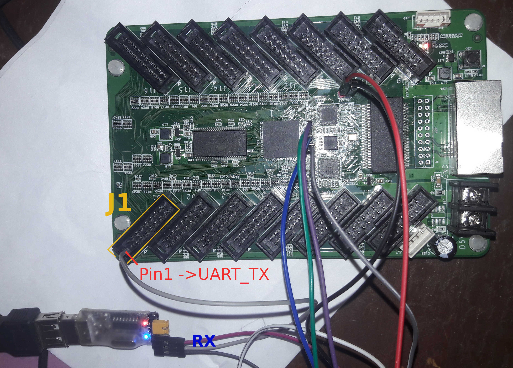

# Tranmisión de datos por UART




En éste ejemplo se transmiten los números del 0 al 9 por el módulo UART a una tasa de 9600 baudios; cada segundo se
incrementa el valor del número a enviar acompañado de un blink en el LED.
En la imagen se puede observar que el transmisor TX UART se encuentra en el **pin 1** del conector **J1** 

Sintetizar:

```bash
make all
```

El anterior comando genera los archivos top.svf y top-flash.svf para programar la FPGA

Después de programar la FPGA puede ver en la Terminar serial el resultado como sigue:

```bash
minicom -o -b 9600 -D /dev/ttyUSB0
```

## Referencia

[Ejemplo de uart para placas ice40](https://github.com/nesl/ice40_examples/tree/master/uart_transmission)

