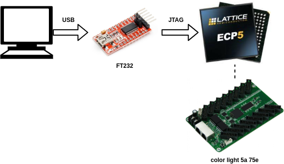
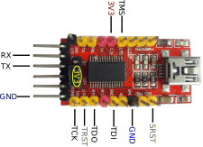
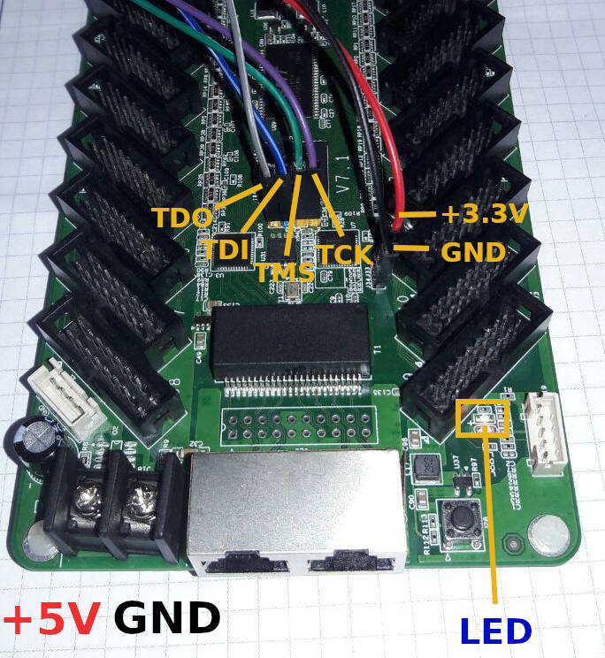
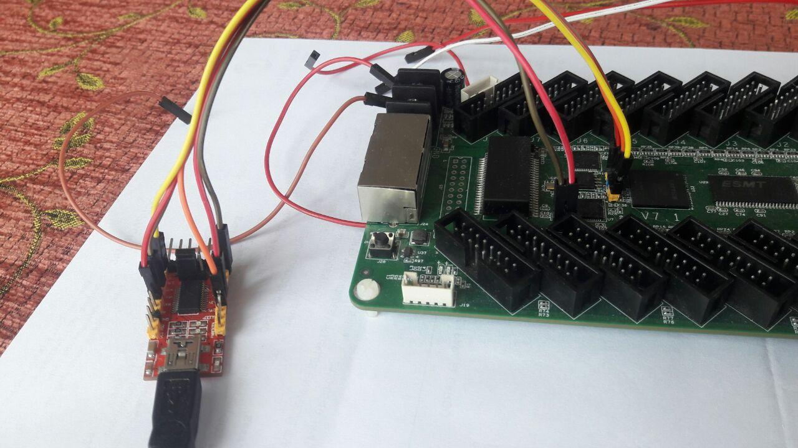

# Programación de ColorLight 5A-75E con adaptador USB FT232



El adaptador USB-FT232 es usado generalmente como adapatdor USB a UART con niveles
de tensión de 5V o 3.3V. En éste ejemplo se mostrará como usa éste adapatdor para
programar la FPGA usando el protocolo JTAG.

## Requerimientos

* Adaptador USB FT232
* Cable USB
* ColorLight 5A 75E
* Archivos fuentes de  [openocd](https://sourceforge.net/projects/openocd/)
* Archivo de [configuración de FPGA](./blink.svf) para hacer el blink en la FPGA.
* Script de programación [program.sh](./program.sh)
* Archivo de [configuración para el ftdi232](./ft232r.cfg)

**Nota**: En el siguiente [archivo .zip](./blink-example-ft232.zip) encontrará los archivos
anteriormente mencionados, suficientes para probar el paso 3 en adelante.

## Conexiones

Tenga presenta la siguiente información para conectar la FPGA y el adapatdor FT232.




Etiquetas de los pines en los modos UART y JTAG

|Pin|FT232 UART|FT232 JTAG|
|:-------------:|:-------------:|:-----:|
|1*| TXD|TDI|
|5*| RXD|TDO|
|11|CTS|TCK|
|3| RTS|TMS|
|2| DTR|TRST**|
|9| DSR|SYSRST**|

En la anterior tabla:

* \* Pines compartidos para la comunicación UART y JTAG

* \**Señales que no serán usadas para configurar la FPGA 






## Pasos

### 1. Compilación de openocd con soporte para el dispositivo ft232r

```bash
git clone https://git.code.sf.net/p/openocd/code openocd-code
cd openocd-code
./bootstrap
./configure --enable-ft232r
make
sudo make install
```


### 2. udev rules y permisos de usuario

A continuaci'on se presenta dos ejemplos que podrán ayudar con la creación de reglas
y permisos para uso del adaptador FT232

#### Reglas udev

Crear un archivo de la regla para el FT232:

```bash
sudo nano /etc/udev/rules.d/53-lattice-ftdi.rules
```

Agregar el siguiente contenido:

```bash
#ATTRS{idVendor}=="0403", ATTRS{idProduct}=="6010", MODE="0660", GROUP="plugdev", TAG+="uaccess"
#ATTRS{idVendor}=="0403", ATTRS{idProduct}=="6010", ATTRS{serial}=="FT1X69GT",MODE="0660", GROUP="plugdev", TAG+="uaccess"
#ATTRS{idVendor}=="0403", ATTRS{idProduct}=="6010", GROUP="usb"
SUBSYSTEM=="tty", ATTRS{idVendor}=="0403", ATTRS{idProduct}=="6001", ATTRS{serial}=="FT1X69GT", SYMLINK+="ttyUSBFTDI"
```

#### Permisos de usuario

```bash
sudo usermod -a -G dialout $USER
```

### 3. Configuración de FPGA Blink

Para hacer el blink de prueba, ejecute el siguiente comando

```bash
sh program.sh blink.svf
```

Inmediatamente después de la ejecución el LED de usuario de FPGA iniciará
el parpadeo.


### Observaciones

El principal uso del ft232 es la comunicación UART, pero cuando
es usado por el openocd para configurar la FPGA, el sistema operativo
después de ésta acción ya no lo detecta como un puerto serial `/dev/ttyUSBx`; a continuación
planteo un par de consejos:

1. Cuando desee configurar la FPGA por éste medio, desconecte los pines
correspondientes a RX y TX del adaptador UART antes de proceder.

2. Si ha configurado la FPGA haciendo uso del adaptador FT232 y seguido,
quiere con éste probar una comunicación UART, desconecte el
adaptador del puerto USB de su equipo y seguido de ello vuelva a conectar,
al revisar por ejemplo con el comando `ls -l /dev/ttyUSB*` el adaptador
volverá a tener un archivo que lo represente como un dispositivo serial-terminal.


## Referencias

[Esquema de conexión de ft232r-jtag](http://vak.ru/doku.php/proj/bitbang/bitbang-jtag)

[Debug adapter configuration](http://openocd.org/doc/html/Debug-Adapter-Configuration.html)

[Debug Adapter Hardware](http://openocd.org/doc/html/Debug-Adapter-Hardware.html)
