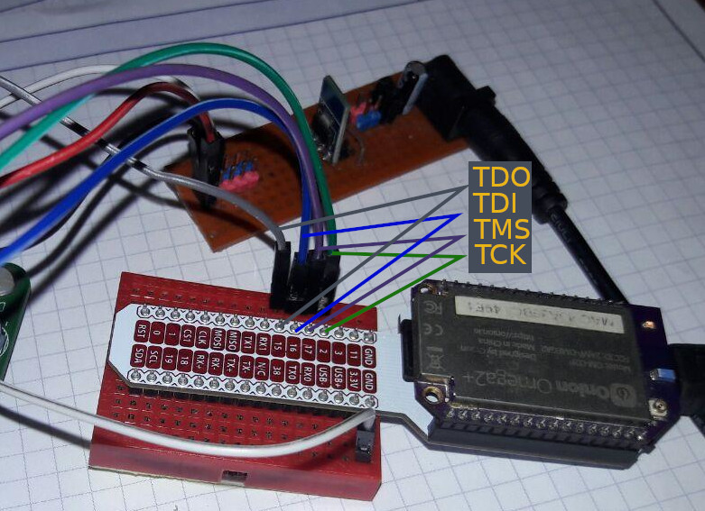
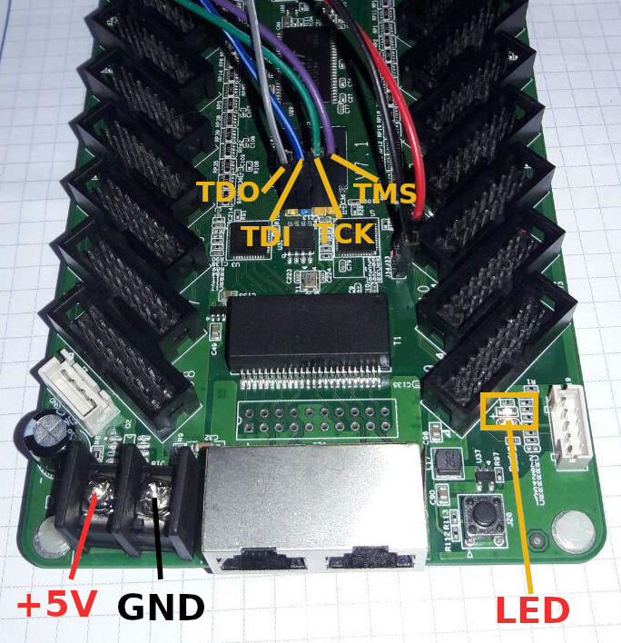

# Ejecutar Blink en ColorLight 5A-75E

En éste ejemplo se usará la omega2 para programar por jtag la fpga (ecp5) de la colorlight 5A-75E V7.1.





### Archivos a usar

* **program.sh** guión que contiene el procedimiento para habilitar los gpio de la omega2 para el jtag y ejecuta openocd con la configuración de la fpga
* **ecp5-25f.cfg** configuración que usará openocd para programar la flash o la fpga directamente
* **sysfsgpio-onion.cfg** configuración de los gpio usados para el jtag, éste archivo es llamado por ecp5-25f.cfg como una fuente
* **blink.svf** síntesis del blink que será ejecutada en la fpga

## Requerimientos

* **OpenOCD** instalado en omega2 (En éste repositorio en el directorio **../omega-packs/** encontrará los precompilados de openocd para instalar en omega2)
* **ssh server** en omega2 (Generalmente viene preinstalado en la omega2)

## Pasos para ejecutar el blink

### 1. Subir archivos desde el PC a la omega2

Debe conocer la dirección ip de la omega2 y ésta ser accesible desde su PC
```bash
scp program.sh ecp5-25f.cfg blink.svf sysfsgpio-onion.cfg root@ip_de_omega2:/root/
```

### 2. Ejecutar blink

Hacer loggin por ssh a la omega2

```bash
ssh root@ip_de_omega2
```

Programar fpga

```bash
sh program.sh
```

**Observación**: la programación será realizada directamente en la ram de la fpga,
si se desea programar la flash revise el siguiente ejemplo: ... //TODO crear ejemplo y enlazar

## Referencias

[Configuración openocd para ecp5-x](https://github.com/f32c/f32c/tree/master/rtl/proj/lattice/programmer/openocd/ulx3s)

[Fuentes verilog para el blink.svf usado](https://github.com/Martoni/MartoniColorlight/tree/master/simpleBlink)

[Configuración de interfaz jtag openocd para omega2](https://github.com/johnnycubides/onion-medialab/tree/master/sw/omega-packs/stm32f100)
