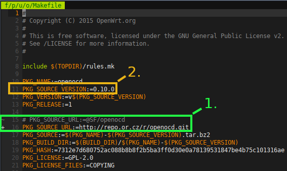
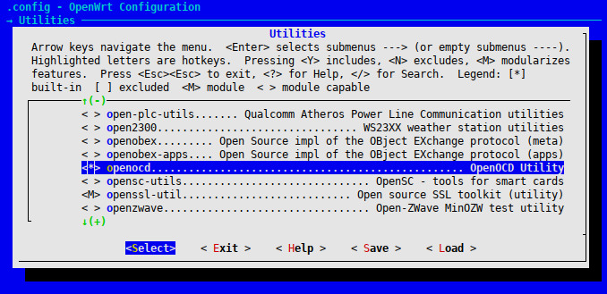

# Cross compilar openocd para Omega2

## PASOS

### 1. Instalar cross compilador para omega2

Siga los pasos de instalación del cross compilador para omega2 que encontrará en [éste link oficial](https://docs.onion.io/omega2-docs/cross-compiling.html)

### 2. Descarga de archivos fuente de openocd

```bash
scripts/feeds update -a
scripts/feeds install openocd
```

**Observación**: Si tiene problemas para obtener los archivos fuentes de openocd
haga la siguiente modificación en:

En `feeds/packages/utils/openocd/Makefile` cambie el valor de **PKG_SOURCE_URL** a
*http://repo.or.cz/r/openocd.git*, ejemplo:



En la imagen anterior también se puede apreciar en *2.* la version de las fuentes a
descargar.

### 3. Cross compilar openocd

Lanzar el menú de configuración:

```bash
make menuconfig
```
Y activar la opción de openocd en **Utilities>openocd**, ejemplo:



Cross compilar

```bash
make
```

Para localizar el paquete openocd construido puede usar el siguiente comando:

```bash
find ./ -iname "*.ipk" | grep openocd

```
## Dependencias para openocd

Verifique y suba a la onion los siguientes paquetes que son prerrequisito para
el funcionamiento de la onion:

* hidapi
* libusb-1.0
* libusb-compat
* libftdi1

Puede hacer uso del siguiente comando para detectar los paquetes cross compilados (poniendo el nombre del prerrequisito)

find ./ -iname "*.ipk" | grep nombre_de_prerrequisito

## Instalar en omega2

Ésta tarea se puede realizar por **ssh**, a continuación se presenta un ejemplo:

**Subir paquete**
```bash
scp paquete_a_subir.ipk root@ip_de_omega:/root/
```

**Acceder a la onion por ssh**

```bash
ssh root@ip_de_omega
```

**Instalar paquete**

```bash
opkg install paquete_subido.ipk
```

## Referencia

[Archivos fuentes de openocd](https://github.com/ntfreak/openocd)

[Instrucciones Omega2 para cross compilar](https://docs.onion.io/omega2-docs/cross-compiling.html)


