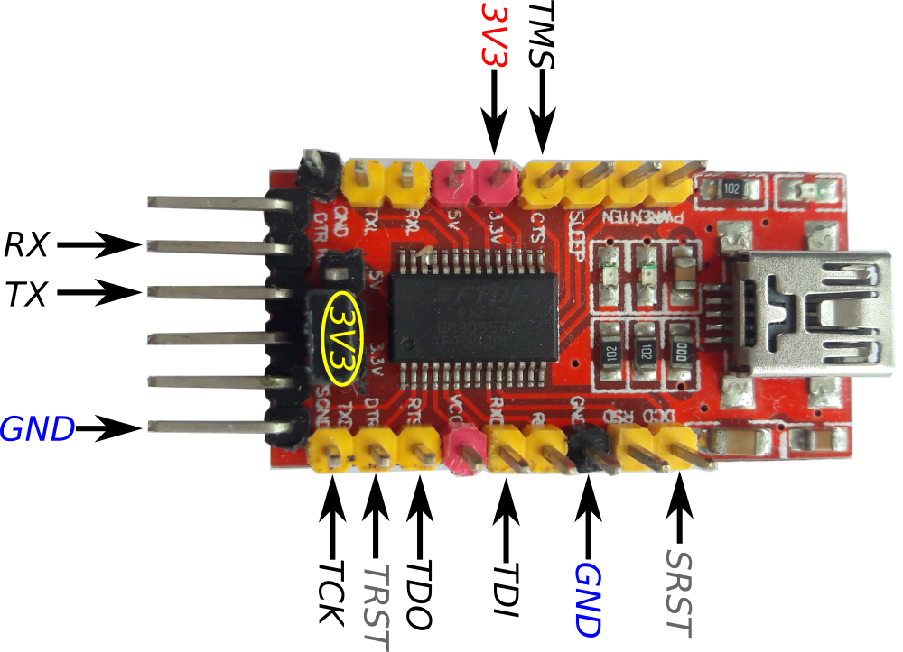

# OpenFPGALoader


Se presenta a continuación un ejemplo para poder configurar la ECP5 de la colorlight
haciendo uso de **openFPGALoader**, un adaptador FT232RL y un archivo de configuración .bit
creado con las herramientas de síntesis libres.

Aunque el proceso de compilación y uso de openFPGALoader está documentado en su repositorio
oficial, el ejemplo presentado a continuación puede ser usado como referencia para sus propias
adaptaciones.

## Pasos

### 1. Clone el repositorio de openFPGALoader

Clone el repositorio y ubíquese en él:

```bash
git clone https://github.com/trabucayre/openFPGALoader.git
cd openFPGALoader
```

### 2. Edición de archivos fuente

Para nuestro objetivo se requiere modificar el archivo **board.hpp** ubicado en
`src/board.hpp` donde encontrará algo similar a lo siguiente:

```C
static std::map <std::string, target_cable_t> board_list = {
	{"arty",       {"digilent",   {}}},
	{"colorlight", {"",           {}}},
  ...
```

De lo anterior puede darse cuenta que para la *colorlight* el valor siguiente es un **string** vacío.
De aquí comparando con los demás elementos listados (en éste caso boards) para la colorlight no hay
un "cable" (adaptador para configurar) asignado, es allí donde agregaremos el adaptador teniendo en cuenta
el pinout usado por nosotros.

#### 2.1 Pinout FT232RL



De la anterior imagen, se puede apreciar los pines seleccionados para emular los pines de JTAG. Por un lado
tenga presente que éste selección puede ser arbitraria, en el caso del ejemplo,
se hizo uso de los mismo pines que usa openocd en el bitbang sin hacer cambios.

Teniendo presente la anterior imagen, ahora vea el siguiente enum que representa los pines de FT232RL, identifíquelos
antes de continuar la lectura.
```C
enum {
	FT232RL_TXD = 0,
	FT232RL_RXD = 1,
	FT232RL_RTS = 2,
	FT232RL_CTS = 3,
	FT232RL_DTR = 4,
	FT232RL_DSR = 5,
	FT232RL_DCD = 6,
	FT232RL_RI  = 7
};
```

La información anterior del enum y la de la siguiente struct están en el archivo `src/board.hpp`

```C
typedef struct {
	uint8_t tms_pin; /*! TMS pin offset */
	uint8_t tck_pin; /*! TCK pin offset */
	uint8_t tdi_pin; /*! TDI pin offset */
	uint8_t tdo_pin; /*! TDO pin offset */
} jtag_pins_conf_t;
```

La anterior struct representa el pinout para emular el JTAG, tengalo presente porque será el orden
de los pines que usará para indicarle a openFPGALoader como usar los pines del adaptador FT232RL.

En el ejemplo, se tiene presente los pines seleccionados en la imagen de arriba del adaptador FT232RL
y se ubican ordenadamente teniendo en cuenta la struct jtag_pins_conf_t. Se reitera que ésta información
debe ser editada y guardada en el respectivo archivo `src/board.hpp`.

```C
static std::map <std::string, target_cable_t> board_list = {
	{"arty",       {"digilent",   {}}},
	{"colorlight-ft232rl",      {"ft232RL",  {FT232RL_CTS, FT232RL_TXD, FT232RL_RXD, FT232RL_RTS}}},
  ...
```

### 3. Compilación e instalación de openFPGALoader

Los comandos siguientes son los mismos que se describen en la documentación oficial de openFPGALoader:

#### 3.1 Instalación de dependencias

```bash
sudo apt install libftdi1-2 libftdi1-dev libudev-dev cmake
```

#### 3.2 Compilación e instalación

Recordar estar en el nivel del directorio clonado de openFPGALoader

```bash
mkdir build
cd build
cmake ../
make -j$(nproc)

sudo cp 99-openfpgaloader.rules /etc/udev/rules.d/
sudo udevadm control --reload-rules && udevadm trigger
sudo usermod -a `whoami` -G plugdev
```

## 4. Ejemplo de uso

Instalada y compilada la herramientas, podrá hacer uso de la board **colorlight-ft232rl**. Se muestra a continuación una lista
de ejemplos de uso.

|COMANDO|USO|
|:-------------:|:-------------:|
|openFPGALoader -b colorlight-ft232rl --detect |Detectar FPGA|
|openFPGALoader -b colorlight-ft232rl -m file.bit |Configurar FPGA desde la **sram**|
|openFPGALoader -b colorlight-ft232rl -f file.bit |Configurar FPGA desde la **flash**|

**Observación**: Haga uso del argumento `--verbose` para obtener más información de la ejecución
del comando.

**Nota**: Puede crear más combinaciones de boards y cables como se mostró en éste ejemplo, las combinaciones
dependerán de adaptador que tenga a disposición.

## Referencias

[Repositorio openFPGALoader](https://github.com/trabucayre/openFPGALoader)

[15$ ECP5 board kit](http://www.fabienm.eu/flf/15-ecp5-board-kit/)
