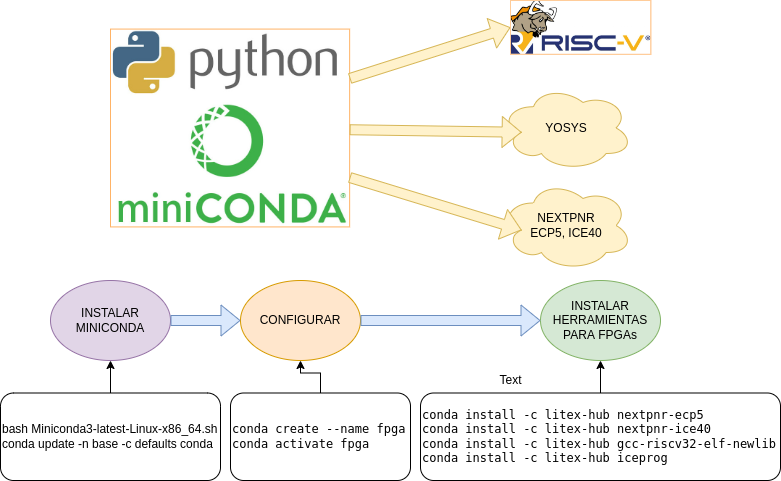

# Instalación de Herramientas para FPGAs ECP5 e ICE40 en CONDA



Conda permite administrar las herramientas de desarrollo de manera sencilla
ya que en éste caso nos ofrece los precompilados de Yosys, nextpnr, compiladores
y otras herramientas útiles, que en otros casos deberían ser compiladas desde
las fuentes, lo que requiere más recursos.

Los comandos a usar son sencillos tanto para instalar, actualizar y ejecutar entornos.
A continuación se explica los pasos de instalación de las herramientas.

## Herramientas a instalar

* [Yosis](https://github.com/YosysHQ/yosys)
* [Nextpnr](https://github.com/YosysHQ/nextpnr)
* [gcc riscv32](https://github.com/riscv/riscv-gnu-toolchain)

## Pasos de instalación

### 1. Instalación de MINICONDA

**Nota**: No existe problema si en su PC tiene una versión de `python3` instalada.

#### 1.1 Descargar [miniconda de éste link](https://docs.conda.io/en/latest/miniconda.html#linux-installers)


#### 1.2 Instalación de MINICONDA

Ejecute el siguiente comando y siga las instrucciones del instalador
```bash
bash Miniconda3-latest-Linux-x86_64.sh
```

**nota 1**: el directorio de instalación de miniconda por default será `/home/user/miniconda3`

**nota 2**: Ésta instalación afecta directamente al bashrc ubicado en `~/.bashrc`,
se recomienda revisar el estado de éste archivo donde miniconda3 agregó las líneas al final

#### 1.4 Actualizar miniconda

```bash
conda update -n base -c defaults conda
```

#### 1.5 Creación de entorno

Un entorno permite que conda presente las herramientas según nuestros
intereses; por ejemplo si se crea el entorno FPGA y se instala las herramientas
deseadas, cada vez que active ese entorno, conda agregará al PATH los binarios y
librerías que se ha instalado para tal fin; es una manera de organizar nuestros recursos.

**Nota**: en realidad conda crea un entorno `base` así que sino desea crear un entorno
podría saltarse éste paso teniendo encuenta éste hecho.

Ejecute el siguiente comando para crear el entorno **FPGA**:

```bash
conda create --name fpga
```

Para activar el entorno creado ejecute el siguiente comando:

```bash
conda activate fpga
```

### 2. Instalación de NEXTPNR, YOSYS y cross-compiladores

```bash
conda install --channel "TimVideos" nextpnr-ecp5
conda install --channel "TimVideos" nextpnr-ice40
conda install --channel "TimVideos" gcc-riscv32-elf-newlib
conda install --channel "TimVideos" iceprog
```

#### Verificación de herramientas instaladas

```bash
yosys -V
nextpnr-ecp5 -V
riscv32-unknown-elf-gcc -v
```

## Fuentes

[Documentación de miniconda](https://docs.conda.io/en/latest/miniconda.html)

[Instalación de miniconda](https://conda.io/projects/conda/en/latest/user-guide/install/linux.html)

[Manejo de entornos conda](https://docs.conda.io/projects/conda/en/latest/user-guide/getting-started.html#managing-environments)

[Manejo de entornos en coda](https://uoa-eresearch.github.io/eresearch-cookbook/recipe/2014/11/20/conda/)

[Canal conda de timvideos](https://anaconda.org/timvideos/repo/installers)

[litex-conda-packages](https://github.com/litex-hub/litex-conda-packages)
