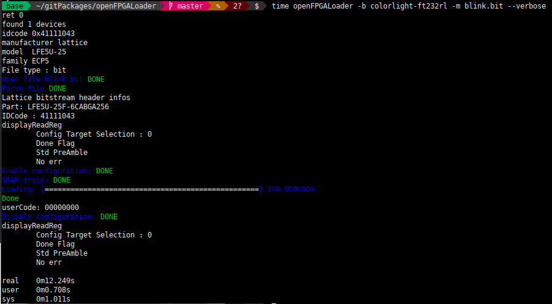
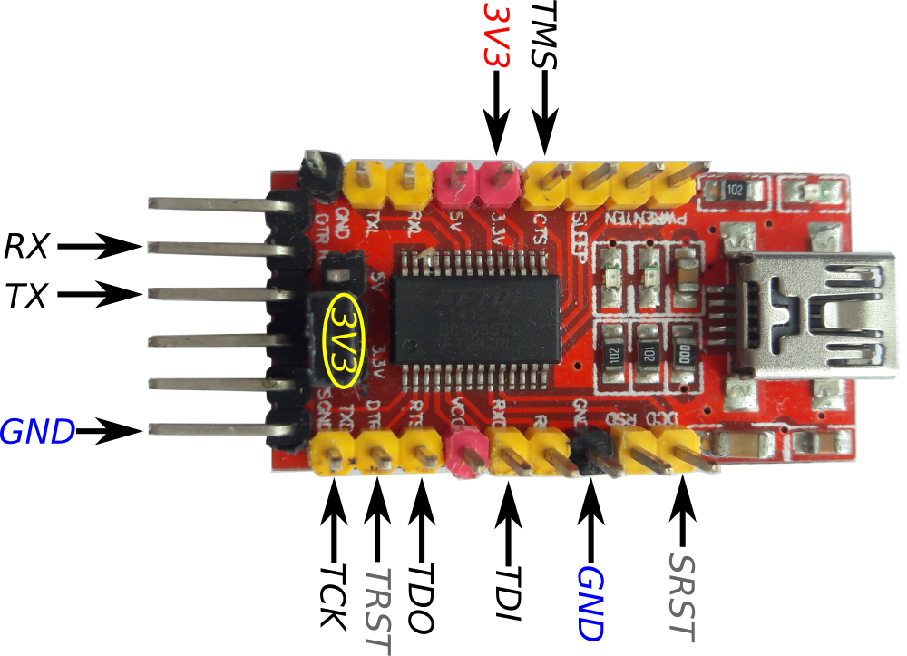

# OpenFPGA Loader




En el archivo `src/board.hpp`

```C
static std::map <std::string, target_cable_t> board_list = {
	{"arty",       {"digilent",   {}}},
	{"colorlight", {"",           {}}},
  ...
```




```C
enum {
	FT232RL_TXD = 0,
	FT232RL_RXD = 1,
	FT232RL_RTS = 2,
	FT232RL_CTS = 3,
	FT232RL_DTR = 4,
	FT232RL_DSR = 5,
	FT232RL_DCD = 6,
	FT232RL_RI  = 7
};
```

```C
typedef struct {
	uint8_t tms_pin; /*! TMS pin offset */
	uint8_t tck_pin; /*! TCK pin offset */
	uint8_t tdi_pin; /*! TDI pin offset */
	uint8_t tdo_pin; /*! TDO pin offset */
} jtag_pins_conf_t;
```

```C
static std::map <std::string, target_cable_t> board_list = {
	{"arty",       {"digilent",   {}}},
	{"colorlight-ft232rl",      {"ft232RL",  {FT232RL_CTS, FT232RL_TXD, FT232RL_RXD, FT232RL_RTS}}},
  ...
```

## Ejemplo de uso

|COMANDO|USO|
|:-------------:|:-------------:|
|openFPGALoader -b colorlight-ft232rl --detect |Detectar FPGA|
|openFPGALoader -b colorlight-ft232rl -m file.bit |Configurar FPGA desde la **sram**|
|openFPGALoader -b colorlight-ft232rl -f file.bit |Configurar FPGA desde la **flash**|

**Observación**: Haga uso del argumento `--verbose` para obtener más información de la ejecución
del comando.

## Referencias

[Repositorio openFPGALoader](https://github.com/trabucayre/openFPGALoader)

[15$ ECP5 board kit](http://www.fabienm.eu/flf/15-ecp5-board-kit/)
